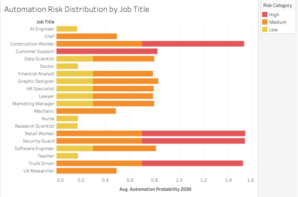
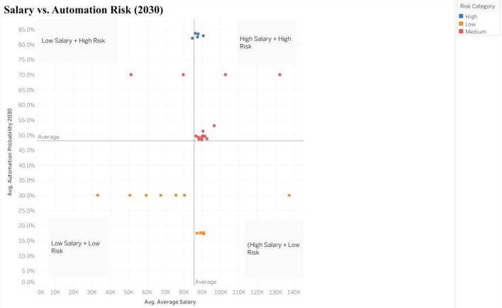
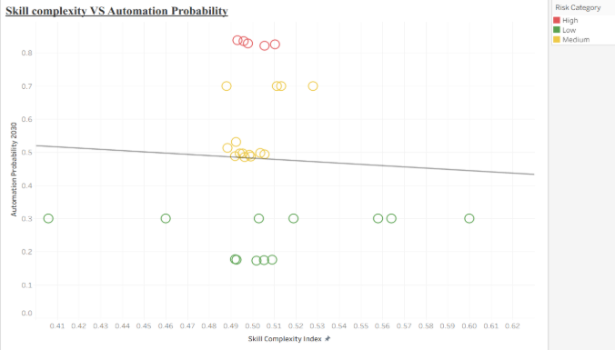
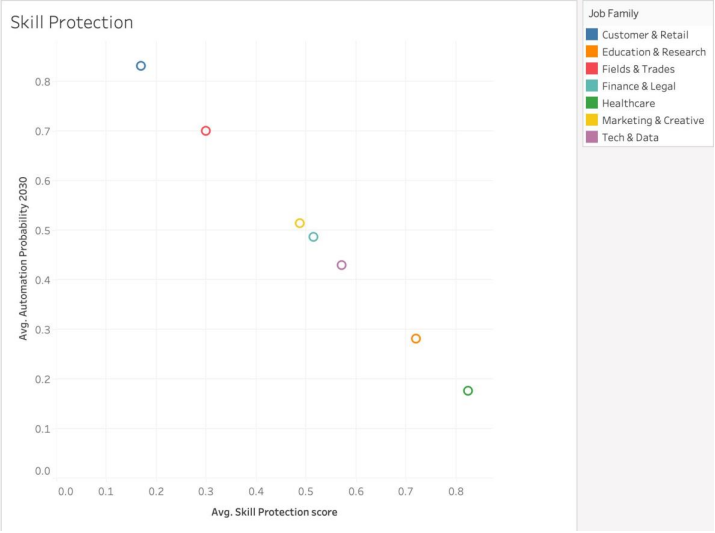

# AI Disruption & Automation Risk Analysis
Exploring how artificial intelligence may reshape the workforce by 2030.

**Tools:** Tableau • R • Data Visualization • Workforce Analytics

---

## Project Overview

Artificial intelligence is rapidly changing how work is done across many industries. This project explores a dataset that estimates the **probability that different jobs could be automated by 2030**.

The goal was to understand what actually makes certain jobs more vulnerable than others.

Rather than focusing only on job titles, the project looks at the **structure of work itself**, including skill complexity and task characteristics.

---

## Key Questions

The analysis focused on a few core questions:

- Which industries appear most exposed to automation?
- Do education or years of experience protect jobs from automation?
- What role do skills and task complexity play?

---

## Approach

The project combined **data visualization in Tableau** with **statistical checks in R**.

### Step 1 – Data Exploration
The dataset includes projected automation probabilities along with job characteristics such as salary, education level, and skill indicators.

### Step 2 – Skill Metrics
To better interpret the dataset, two additional measures were created:

- **Skill Complexity Index** – captures how cognitively demanding a role is  
- **Skill Protection Score** – estimates how resistant a job’s tasks are to automation  

### Step 3 – Statistical Checks
Before building visualizations, relationships between variables were tested in **R** to make sure patterns seen in charts were meaningful and not just random noise.

### Step 4 – Visual Analysis
Visualizations were created in Tableau to explore relationships between:

- job type and automation risk
- salary and automation exposure
- skill complexity and automation probability

---

## Visual Analysis

### Automation Risk by Job Role

### Salary vs Automation Risk

### Skill Complexity vs Automation Probability

### Skill Protection vs Automation Risk

---

## Tools Used

- Tableau
- R
- Data Visualization

---

## Repository Contents

analysis/ → R scripts used for statistical validation  
visuals/ → charts used in the analysis  
report/ → final project report
